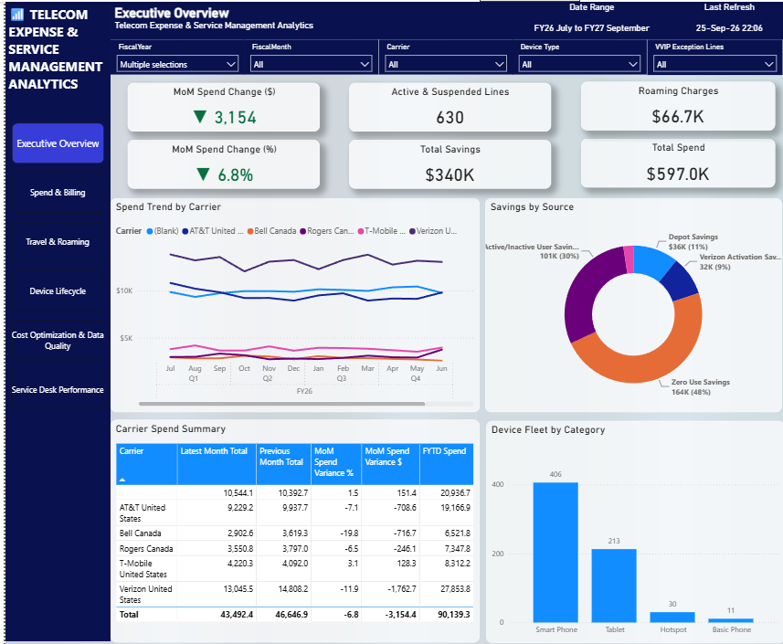
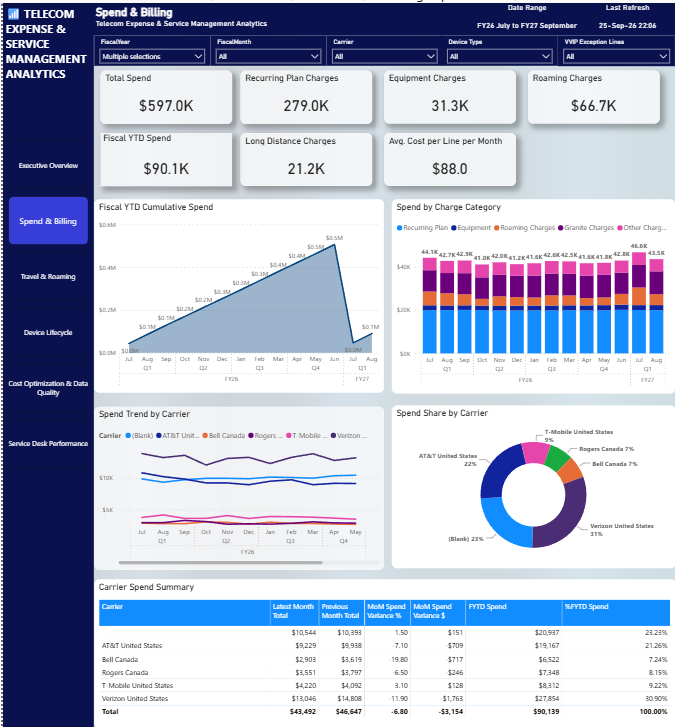
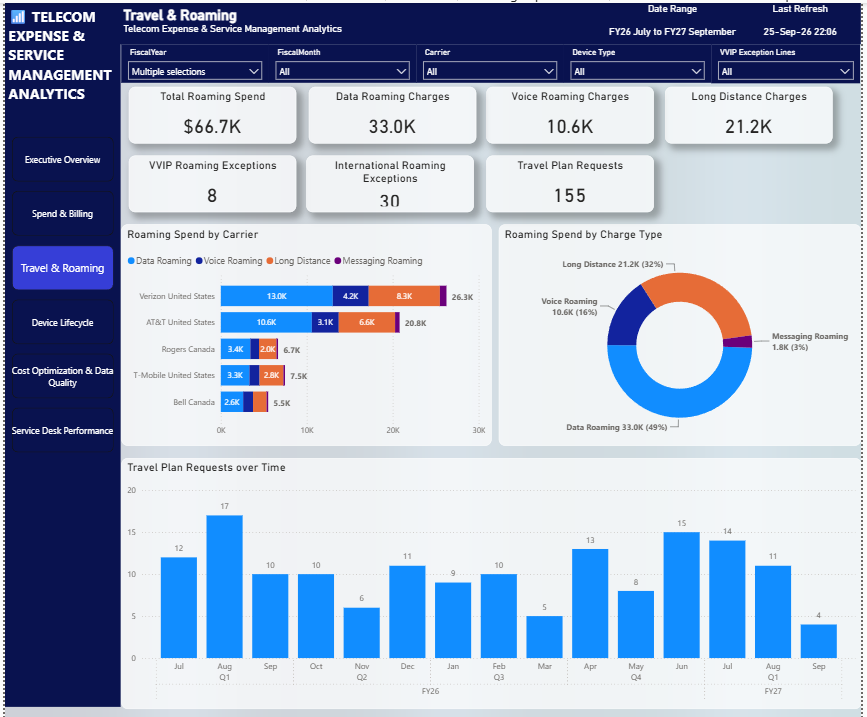
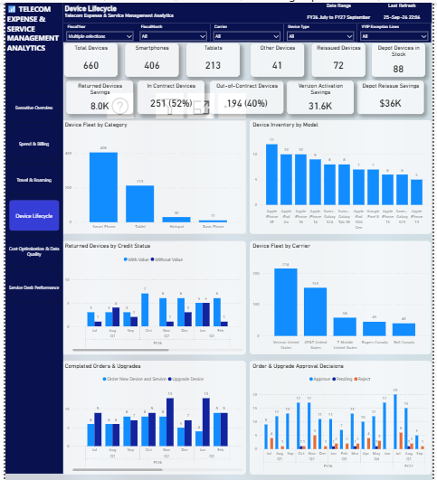
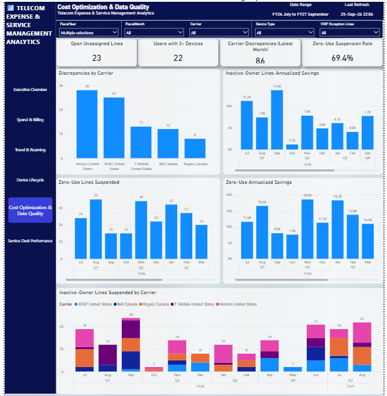
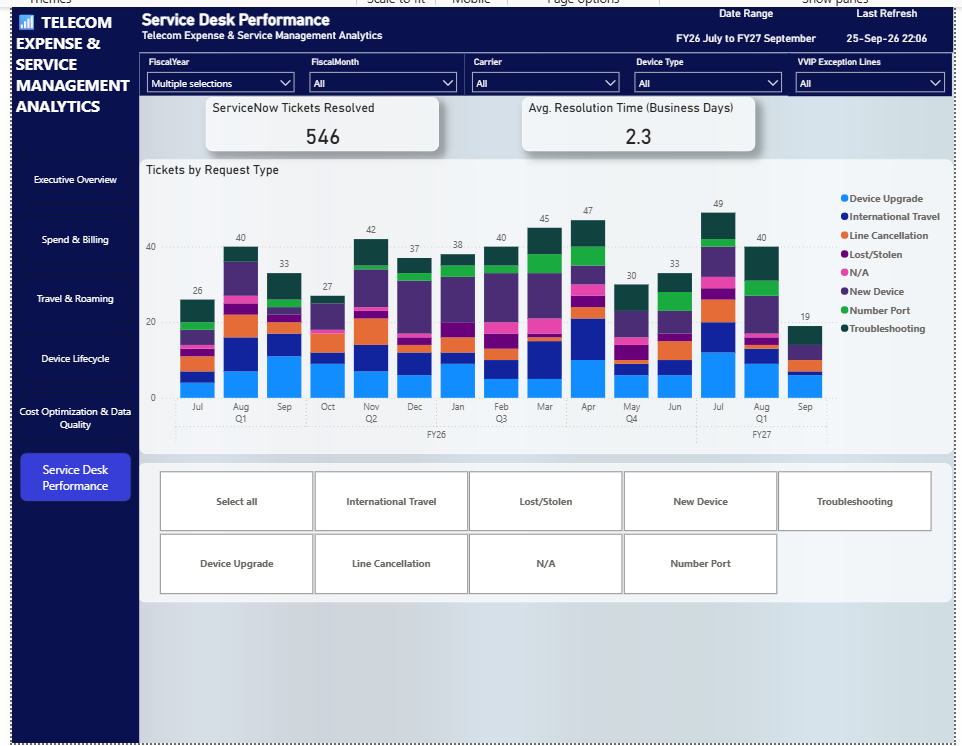
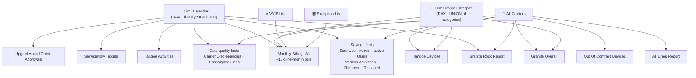

# Telecom Expense & Service Management Analytics

**Power BI · DAX · Power Query (M) · TMDL / PBIP · Python**

An end-to-end Power BI solution for the **Telecom Expense Management (TEM)** function of a large enterprise.
It gives IT, Finance and the Mobility team one place to see **mobile spend, device fleet health,
cost-saving initiatives, data quality and service-desk performance** across five carriers in the US
and Canada.

> This dashboard was originally built for a real corporate mobility team, on top of carrier bills,
> TEM-platform exports and ServiceNow data. The public version runs on a **fully synthetic dataset**
> for the fictional company *Contoso*, generated by [`scripts/generate_data.py`](scripts/generate_data.py).
> The model, measures and report design are unchanged. None of the names, numbers or phone numbers
> belong to real people or companies.



---

## Business problem

A company with hundreds of corporate mobile lines has to deal with the following:

- **Fragmented bills.** Each carrier (Verizon, AT&T, T-Mobile, Bell, Rogers) invoices on its own
  cycle and in its own format, and store tablets are billed separately by an IoT provider (Granite).
- **Hidden waste.** Some lines have no usage, some belong to employees who have left, some devices
  are never activated and trigger carrier chargebacks, and some users carry 3+ devices.
- **Unpredictable roaming.** Travel costs spike in summer and December.
- **Poor data quality.** Carrier bills and the TEM inventory drift out of sync.
- **No view of service.** Nobody can see how fast mobility requests actually get resolved.

The dashboard answers these questions:

| Question | Where it's answered |
|---|---|
| What do we spend, and how did it change vs. last month and fiscal YTD? | Executive Overview, Spend & Billing |
| Which carriers and charge types drive spend? | Spend & Billing |
| How much do international travel and roaming cost, and who is exempt? | Travel & Roaming |
| How big and how old is the device fleet? What's out of contract? | Device Lifecycle |
| How much have our optimization initiatives saved? | Executive Overview, Cost Optimization |
| Are carrier bills and our inventory in sync? | Cost Optimization & Data Quality |
| How quickly does the service desk resolve mobility requests? | Service Desk Performance |

## Report pages

| # | Page | Highlights |
|---|---|---|
| 1 | **Executive Overview** | Total spend, MoM change ($ / %) with ▲▼ indicators, active lines, total savings, spend trend by carrier, savings by source, device fleet mix |
| 2 | **Spend & Billing** | Spend by charge category (plan, equipment, roaming, Granite, other), fiscal-YTD cumulative trend, carrier share, carrier summary matrix (latest vs. previous month, MoM, FYTD) |
| 3 | **Travel & Roaming** | Roaming spend by carrier and charge type, VVIP and international roaming exceptions, travel-plan request trend |
| 4 | **Device Lifecycle** | Fleet by category and carrier, in/out-of-contract split, depot stock by model, reissue and returned-device savings, order/upgrade approvals |
| 5 | **Cost Optimization & Data Quality** | Zero-use and inactive-owner line suspensions with annualized savings, carrier-vs-inventory discrepancies, unassigned lines, users with 3+ devices |
| 6 | **Service Desk Performance** | ServiceNow tickets resolved, average resolution time in business days, tickets by request type over time |
| – | *Tooltip – MoM Variance* | Report-page tooltip explaining how month-over-month variance is calculated |

Every page shares the same slicer panel: **Fiscal Year, Fiscal Month, Carrier, Device Category,
Line Label (VVIP / Exceptions / Others)**. Pages are linked by a page navigator. In total the report
has 6 pages, 150+ visual elements and 49 KPI cards.

<details>
<summary><b>More screenshots</b></summary>







</details>

---

## Architecture

```mermaid
flowchart LR
    subgraph Sources["Data sources"]
        A1["Carrier bills<br/>(via Tangoe TEM exports)"]
        A2["Granite invoices<br/>and SIM usage"]
        A3["Tangoe inventory<br/>and activity log"]
        A4["ServiceNow<br/>request items"]
        A5["Team trackers<br/>(savings, depot, approvals,<br/>data mismatches)"]
    end
    subgraph PQ["Power Query (M)"]
        P1["DataFolder parameter<br/>+ LoadCsv() function"]
        P2["Type enforcement,<br/>blank → null, column selection"]
    end
    subgraph Model["Semantic model (import)"]
        D1["Dim_Calendar<br/>(fiscal Jul–Jun)"]
        D2["All Carriers"]
        D3["Dim Device Category"]
        F1["22 fact / snapshot tables"]
        M1["All Measures<br/>30 DAX measures"]
    end
    R["Power BI report<br/>6 pages"]
    Sources --> PQ --> Model --> R
```



**Production vs. portfolio connectivity**

| | Production version | This repository |
|---|---|---|
| Storage | SharePoint Online document libraries (Excel workbooks) plus a SharePoint list synced from ServiceNow | Local CSV files in [`data/`](data) |
| Connectors | `SharePoint.Files`, `SharePoint.Tables`, `Excel.Workbook` | `Csv.Document(File.Contents(...))` |
| Ingestion logic | Dynamic combine of monthly worksheets (sheet names parsed as `Mon'YY`), separate handling of the pre-2026 file layout, phone-number cleansing, de-duplication, anti-join between the VVIP and exception lists | One reusable `LoadCsv(name, types)` function that reads a file, keeps the modelled columns, turns blanks into nulls and applies data types |
| Refresh | Scheduled refresh in the Power BI Service | Manual refresh in Power BI Desktop |

The switch to CSV touched only the partition queries. Tables, columns, relationships, measures and
visuals are exactly the same as in the production version.

---

## Data model

**26 tables · 30 relationships · 30 measures · 5 calculated columns · 2 calculated tables**

The model is organized as a set of star schemas around shared (conformed) dimensions:



| Group | Tables | Notes |
|---|---|---|
| **Dimensions** | `Dim_Calendar`, `All Carriers`, `Dim Device Category` | The calendar is a DAX table (`CALENDAR` → `TODAY()`) with fiscal year, quarter and month columns. Auto date/time is turned off. |
| **Spend facts** | `Monthly Billings All`, `Granite Rock Report`, `Granite Overall` | Line-level carrier bills with 30+ charge and usage columns, plus Granite invoices and SIM usage |
| **Inventory snapshots** | `Tangoe Devices`, `All Lines Report`, `Out Of Contract Devices`, `Device Depot Inventory` | Current state of lines and devices |
| **Savings initiatives** | `Zero Use Report`, `Active Inactive Users`, `Verizon Activation`, `Returned Devices`, `Reissued Devices` | Each table feeds one slice of **Total Savings** |
| **Operations** | `Tangoe Activities`, `ServiceNow Tickets`, `Upgrades and Order Approvals` (+ `Device Orders`, `Device Upgrade`) | Workflow and service-level data |
| **Data quality** | `Carrier Discrepancies`, `Unassigned Lines`, `Multiple Devices` | Monthly reconciliation results |
| **Line lists** | `VVIP List`, `Exception List` | Drive the calculated column `Monthly Billings All[Label]` (VVIP / Exceptions / Others), which is used as a slicer |

**Modelling choices worth pointing out**

- **Fiscal calendar (July–June)**: all time intelligence is written against `Dim_Calendar`
  instead of relying on auto date/time.
- **A "latest month" anchor across two sources**: `[Latest Month]` takes the most recent date from
  *both* carrier bills and Granite invoices (`UNION` + `MAXX`). Every MoM and FYTD measure is built on it.
- **Slicer-aware vendor logic**: Granite invoices have no line-level detail, so `[Granite Charges]`
  returns `BLANK()` when the user filters to non-tablet devices or to VVIP/Exception lines. This
  keeps the numbers honest.
- **Controlled filter paths**: device category has to filter across billing, Tangoe inventory and Granite
  SIMs, which needs a few bidirectional and many-to-many relationships. The Granite ↔ Billing link on
  product category is kept **inactive** so the model has no ambiguous filter paths.
- **A dedicated measure table** (`All Measures`) with display folders
  `0 Date Context · 1 Spend · 2 Savings · 3 Fleet & Lines · 4 Data Quality · 5 Service Desk`.
  Every measure has a description that appears as a tooltip in the field list.

---

## Key DAX measures

<details>
<summary><b>Latest Month Total</b>: spend in the most recent billing month, regardless of the date slicer</summary>

```dax
VAR LM = [Latest Month]
VAR LMYear = YEAR(LM)
VAR LMMonth = MONTH(LM)
RETURN
    CALCULATE(
        SUM('Monthly Billings All'[Line Bill -> Total Rebilled Charges]),
        FILTER(ALL(Dim_Calendar), Dim_Calendar[Year] = LMYear && Dim_Calendar[MonthNumber] = LMMonth)
    )
    + CALCULATE(
        [Granite Charges],
        FILTER(ALL(Dim_Calendar), Dim_Calendar[Year] = LMYear && Dim_Calendar[MonthNumber] = LMMonth)
    )
```
</details>

<details>
<summary><b>FYTD Spend</b>: fiscal-year-to-date spend up to the latest billing month</summary>

```dax
VAR LM = [Latest Month]
VAR LMFiscalYear =
    CALCULATE(SELECTEDVALUE(Dim_Calendar[FiscalYear]), FILTER(ALL(Dim_Calendar), Dim_Calendar[Date] = LM))
RETURN
    CALCULATE(
        SUM('Monthly Billings All'[Line Bill -> Total Rebilled Charges]),
        FILTER(ALL(Dim_Calendar), Dim_Calendar[FiscalYear] = LMFiscalYear && Dim_Calendar[Date] <= LM)
    )
    + CALCULATE([Granite Charges], FILTER(ALL(Dim_Calendar), Dim_Calendar[FiscalYear] = LMFiscalYear && Dim_Calendar[Date] <= LM))
```
</details>

<details>
<summary><b>Avg Resolution Time (Business Days)</b>: service-desk SLA metric that excludes weekends</summary>

```dax
AVERAGEX(
    FILTER('ServiceNow Tickets', NOT ISBLANK('ServiceNow Tickets'[closed_at])),
    VAR CreatedDate = DATEVALUE('ServiceNow Tickets'[sys_created_on])
    VAR ClosedDate  = DATEVALUE('ServiceNow Tickets'[closed_at])
    RETURN
        CALCULATE(
            COUNTROWS('Dim_Calendar'),
            FILTER('Dim_Calendar',
                'Dim_Calendar'[Date] >= CreatedDate && 'Dim_Calendar'[Date] <= ClosedDate
                && WEEKDAY('Dim_Calendar'[Date], 2) <= 5)
        ) - 1
)
```
</details>

<details>
<summary><b>Total Savings</b>: five savings initiatives combined into one KPI</summary>

```dax
SUM('Active Inactive Users'[Annual Saving])          -- lines of departed employees suspended
    + SUM('Zero Use Report'[Annual Saving])          -- zero-usage lines suspended
    + SUM('Verizon Activation'[Chargeback amount])   -- chargebacks avoided
    + SUM('Returned Devices'[Value])                 -- recycler credits
    + [Reissued Savings]                             -- refurbished depot devices reissued
```
</details>

The full commented measure set is in
[`All Measures.tmdl`](Telecom%20Expense%20and%20Service%20Management%20Analytics.SemanticModel/definition/tables/All%20Measures.tmdl).

---

## Synthetic data

[`scripts/generate_data.py`](scripts/generate_data.py) (Python standard library only, seed `42`) simulates:

- ~620 employees in 10 departments with cost centers and supervisors
- ~515 mobile lines on 5 carriers, with carrier-specific bill-cycle days, plans and 14 device models
- ~15,000 monthly bill records (Jan 2024 – Aug 2026) broken down into plan, equipment installment,
  roaming, tax, fee, credit and usage columns
- Realistic patterns: **summer and December roaming peaks**, a **3% FY26 price increase**,
  suspended and zero-usage lines, VVIP travellers, users with 3+ devices, a **declining trend of
  data-quality issues**, and a backlog of recent open tickets
- ~1,200 ServiceNow tickets, ~1,550 Tangoe activities, depot/return/reissue records and approval workflows

The script reads column names and order straight from the model's TMDL files, so the CSVs cannot
drift out of sync with the Power Query schema.

---

## How to run

1. **Requirements:** a recent version of Power BI Desktop that can open PBIP projects (TMDL and PBIR
   formats). Python 3.9+ is optional and only needed to regenerate the data.
2. Clone the repo and open **`Telecom Expense and Service Management Analytics.pbip`**.
3. Point the model at your local `data` folder: **Transform data → Edit parameters → `DataFolder`**,
   for example `C:\repos\telecom-expense-service-analytics\data\`. Keep the trailing backslash.
4. Click **Refresh**.
5. *(Optional)* Regenerate the data with `python scripts/generate_data.py`.

## Repository structure

```
├── Telecom Expense and Service Management Analytics.pbip          ← open this
├── Telecom Expense and Service Management Analytics.Report/       ← report definition (PBIR, JSON)
├── Telecom Expense and Service Management Analytics.SemanticModel/
│   └── definition/
│       ├── tables/*.tmdl         ← one file per table: columns, measures, Power Query partition
│       ├── relationships.tmdl
│       └── expressions.tmdl      ← DataFolder parameter + LoadCsv() function
├── data/                          ← synthetic CSVs (22 files)
├── scripts/generate_data.py       ← synthetic data generator
└── docs/images/                   ← report screenshots
```

Because the project is saved as **PBIP with TMDL**, every measure, relationship and visual is plain
text. That makes it diff-able in Git and reviewable in pull requests.

---

## Skills demonstrated

- **Data modelling:** multi-fact star schema, conformed dimensions, fiscal calendar,
  active/inactive and bidirectional relationships, a measure table with display folders
- **DAX:** time intelligence without auto date/time, context transition, `CALCULATE` with `ALL`/`FILTER`,
  iterators (`SUMX`, `AVERAGEX`, `MAXX`), table functions (`UNION`, `SELECTCOLUMNS`), `ISFILTERED`-driven
  logic, dynamic text for KPI cards, business-day calculations
- **Power Query (M):** parameterized sources, custom functions, multi-sheet workbook ingestion, cleansing
  and de-duplication, anti-joins
- **Report design:** consistent page template, shared slicer panel, page navigation, report-page
  tooltips, conditional ▲▼ variance indicators
- **Engineering practices:** PBIP/TMDL source control, reproducible synthetic data, schema-driven generation
- **Domain:** telecom expense management, carrier billing structures, device lifecycle, IT service management
